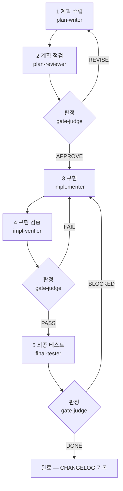

# Claude 개발 표준 킷 (Claude Dev Standard)

Claude Code에 **5단계 게이트 개발 프로세스**를 더하는 플러그인입니다. 계획·점검·구현·
검증·최종 테스트를 전담 에이전트 7종으로 나누고, 증거를 만든 에이전트가 스스로 채점하지
못하게 **판정을 gate-judge가 확정**합니다.

## 무엇을 막나

Claude Code에게 그냥 "만들어줘"라고 할 때 반복되는 AI 개발 보조의 전형적 사고 4가지를
프로세스로 막습니다.

| 자주 나는 사고 | 킷이 막는 방법 |
|---|---|
| 계획 없이 바로 구현 | 설계 먼저(방안 2~3개 비교 → 확인) + 계획 문서(PLAN) 후 구현 |
| 자기 코드를 자기가 검증 | 구현자와 검증자를 다른 에이전트로 분리 + gate-judge가 판정 확정 + 외부 리뷰어(Codex) 교차 검증 |
| 실수로 운영 시스템에 반영 | 위험 작업 목록 등록 → 에이전트는 드라이런까지만, 실제 반영은 사람이 |
| 무엇을 왜 바꿨는지 기록 없음 | 작업마다 CHANGELOG + 게이트 판정을 보고서 파일로 보존 |

## 설치

```
/plugin marketplace add solution194560/claude-dev-standard
/plugin install claude-dev-standard
```

설치하면 스킬 `gated-dev`와 에이전트 7종이 함께 등록됩니다. 이후 대화에서
`"로그인 기능 5단계로 개발해줘"`처럼 말하면 스킬이 트리거되어 게이트 프로세스가 시작됩니다.

## 프로젝트 프로필 (한 번만)

에이전트들은 프로젝트 고유 정보를 프로젝트 루트 `CLAUDE.md`의 **§0 프로젝트 프로필**에서
읽습니다(실행 명령·테스트 명령·주요 산출물·외부 점검 도구·위험 작업 목록). 없으면
[templates/CLAUDE.md.template](templates/CLAUDE.md.template)을 복사해 `{{ }}` 자리를 채우세요.
자세한 절차는 [quickstart](skills/gated-dev/references/quickstart.md).

## 5단계 게이트 한눈에



| 단계 | 에이전트 | 모델(외부 검증) | 판정 |
|---|---|---|---|
| 1 계획 수립 | plan-writer | Opus | — |
| 2 계획 점검 | plan-reviewer | Opus (+GPT-5.6-sol) | APPROVE/REVISE |
| 3 구현 | implementer | Sonnet | — |
| 4 구현 검증 | impl-verifier | Opus (+GPT-5.6-sol) | PASS/FAIL |
| 5 최종 테스트 | final-tester | Sonnet | DONE/BLOCKED |
| 판정 확정 | gate-judge | Opus | 위 게이트(2·4·5)의 판정 확정 |
| 에러 대응 | error-analyst | Opus | 근본 원인 분석(5단계와 별개) |

판정은 게이트 에이전트가 아니라 **gate-judge**가 내립니다. 점검·검증·최종 에이전트는
증거를 모아 **권고**만 하고, gate-judge가 원시 증거를 확인해 판정을 확정합니다. 단건
수정은 5단계 대신 경량 경로를 씁니다 — 기준은 [process](skills/gated-dev/references/process.md).

## 구성

```
claude-dev-standard/
├── .claude-plugin/          플러그인·마켓플레이스 매니페스트
├── skills/gated-dev/
│   ├── SKILL.md             5단계 게이트 프로세스 (트리거·워크플로우)
│   └── references/          상세 문서 (process·agents·rules·session·cost·quickstart·files)
├── agents/                  전담 에이전트 7종 (설치 시 배포)
└── templates/               프로젝트 초기화용 (CLAUDE.md.template 등)
```

## 문서

| 문서 | 내용 |
|---|---|
| [process](skills/gated-dev/references/process.md) | 5단계 게이트 규칙·산출물 명명·경량 경로 |
| [agents](skills/gated-dev/references/agents.md) | 에이전트 7종 역할·모델 교체·Codex 연동 |
| [rules](skills/gated-dev/references/rules.md) | 개발 규칙과 그 이유 |
| [session](skills/gated-dev/references/session.md) | 세션 이어가기 |
| [cost](skills/gated-dev/references/cost.md) | 토큰 비용 통제 |
| [quickstart](skills/gated-dev/references/quickstart.md) | 프로젝트 초기 세팅 |
| [files](skills/gated-dev/references/files.md) | 파일별 상세 설명 |

## Codex 교차 검증 (선택)

2·4단계의 외부 리뷰어로 OpenAI Codex CLI를 씁니다. Claude가 쓴 것을 Claude가 검토하면
같은 맹점을 공유하므로, 다른 모델에게 채점을 맡깁니다. 없어도 킷은 동작하며(에이전트 직접
점검으로 폴백), 프로필의 "외부 점검 도구"에 `없음`이라 적으면 됩니다. 설정·문제 해결은
[agents](skills/gated-dev/references/agents.md).

## Ruler 규칙 배포

`.ruler/`가 공통 안전·프로세스·증거 규칙의 **단일 정본**이고, 이를 Claude(`RULER_CLAUDE.md`)·
Codex(`AGENTS.md`) 대상 파일로 변환·배포합니다. `CLAUDE.md`는 프로젝트 프로필만 남기고 공통
규칙은 맨 아래 `@RULER_CLAUDE.md` 임포트로 로드합니다(중복 제거). 변환 도구로 MIT 라이선스의
[intellectronica/ruler](https://github.com/intellectronica/ruler)(작성자 Eleanor Berger)를
사용하며, 이 저장소에 Ruler 코드는 포함되지 않고 `npx @intellectronica/ruler@0.3.44`로 실행
시점에 내려받습니다.

### 정본↔생성물 운영

| 파일 | 구분 | 규칙 |
|---|---|---|
| `.ruler/00~30-*.md`, `ruler.toml` | 정본 | 규칙 변경은 여기서만 한다 |
| `RULER_CLAUDE.md`, `AGENTS.md` | 생성물 | 직접 수정 금지 · git 추적 |
| `ruler-test/check-sync.sh` | 도구 | 정본↔생성물 일치 대조(읽기 전용) |

`.ruler/`를 수정하면 **사람이** 본 저장소에서 재생성 절차를 수행합니다 — 에이전트는 `ruler apply`를
실행하지 않습니다.

```bash
npx @intellectronica/ruler@0.3.44 apply --agents claude,codex --no-mcp --no-skills --no-gitignore --no-backup --verbose
git diff --stat            # 변경이 생성물 2개뿐인지 확인
bash ruler-test/check-sync.sh   # 정본↔생성물 일치(exit 0) 확인
# .ruler/ 원본 + 생성물 2개를 같은 커밋으로 커밋
```

1차 도입은 5단계 게이트로 시나리오 15/15를, 정본 이관은 오프라인 8건·실데이터 4건 검증을
통과했습니다. 진행 과정과 게이트 판정 기록은 git 커밋 히스토리에 남아 있습니다.

## 라이선스

MIT — [LICENSE](LICENSE)
