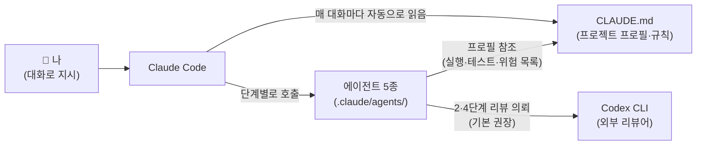
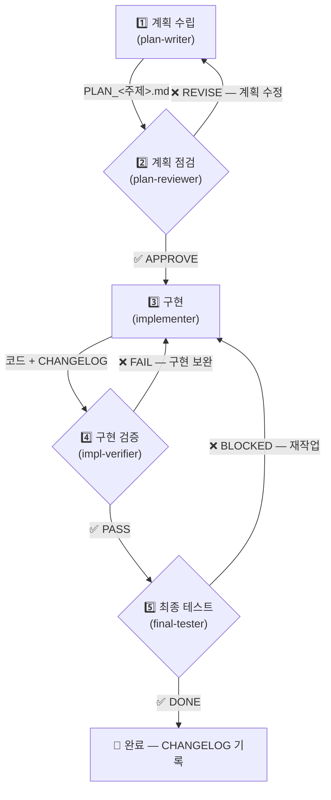
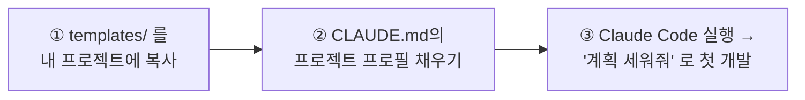

# Claude 개발 표준 킷 (Claude Dev Standard Kit)

Claude Code로 개발을 시작할 때 **초기 세팅 → 5단계 게이트 개발 프로세스**를
바로 적용할 수 있게 해주는 표준 패키지입니다.

- ✅ 제공하는 것: Claude 설정 템플릿(CLAUDE.md), 서브에이전트 5종, 개발 규칙, 초보자 가이드
- ❌ 제공하지 않는 것: 애플리케이션 코드 (이 킷은 "개발하는 방법"의 표준이지 특정 앱이 아님)

---

## 🎯 이 킷을 왜 쓰나 (목적)

Claude Code에게 그냥 "만들어줘"라고 하면 잘 만들 때도 있지만, 실무에서는
**AI 개발 보조의 전형적인 사고 4가지**가 반복됩니다. 이 킷은 그 사고를
프로세스와 규칙으로 막는 것이 목적입니다.

| 자주 나는 사고 | 무엇이 문제인가 | 킷이 막는 방법 |
|---|---|---|
| **계획 없이 바로 구현** | 방향이 틀리면 코드 전체가 재작업 | 설계 먼저(방안 2~3개 비교 → 사용자 확인) + 계획 문서(PLAN) 작성 후 구현 |
| **자기가 짠 코드를 자기가 검증** | "테스트 통과했어요"를 그대로 믿으면 결함이 통과됨 | 구현자와 검증자를 **다른 에이전트**로 분리, 검증자가 테스트 직접 재실행, 외부 리뷰어(Codex)로 교차 검증 |
| **실수로 운영 시스템에 반영** | 댓글 게시·배포·데이터 변경이 실수로 실행됨 | "위험 작업 목록"을 CLAUDE.md에 등록 → 에이전트는 **드라이런까지만**, 실제 반영은 사람이 |
| **무엇을 왜 바꿨는지 기록이 없음** | 한 달 뒤 "이거 왜 이렇게 돼 있지?"에 답 못함 | 작업마다 CHANGELOG 기록 + 게이트 판정을 보고서 파일로 보존 |

한 줄 요약: **"AI에게 개발을 시키되, 회사 개발팀처럼 기획 → 검토 → 개발 → QA →
최종 검수 절차를 밟게 만드는 킷"**입니다.

## 🗂 폴더 구조 — 딱 두 종류만 기억하세요

이 킷의 폴더는 **역할이 두 가지뿐**입니다:

> **`docs/` = 책** (읽기만 하고 복사하지 않음)
> **`templates/` = 부품** (내 프로젝트에 복사해서 씀)

```
claude-dev-standard/               ← 이 킷 (원본은 그대로 둠)
│
├── README.md                      ← 📖 지금 읽는 문서
│
├── docs/                          ← 📖 "책" — 방법을 설명하는 문서 7개
│   ├── 00_files.md                    모든 파일의 상세 설명서
│   ├── 01_quickstart.md               10분 시작 가이드 (복사·치환·첫 실행)
│   ├── 02_process.md                  5단계 게이트 상세 규칙
│   ├── 03_agents.md                   에이전트 5종 + Codex 연동법
│   ├── 04_rules.md                    개발 규칙과 그 이유
│   ├── 05_session.md                  세션 이어가기 (중단·재개)
│   └── 06_cost.md                     토큰 비용 아끼는 법
│
└── templates/                     ← 📦 "부품" — 내 프로젝트로 복사할 파일들
    ├── CLAUDE.md.template             → 내 프로젝트의 CLAUDE.md 가 됨
    ├── CHANGELOG.md.template          → 내 프로젝트의 CHANGELOG.md 가 됨
    ├── SESSION.md.template            → 첫 중단 때 SESSION.md 로 생성됨
    ├── .gitignore.example             → 내 프로젝트의 .gitignore 가 됨
    └── .claude/
        ├── settings.json.example      → .claude/settings.json 이 됨
        └── agents/                    → .claude/agents/ 로 그대로 복사
            ├── plan-writer.md             (1단계: 계획 작성 담당)
            ├── plan-reviewer.md           (2단계: 계획 검토 담당)
            ├── implementer.md             (3단계: 코드 구현 담당)
            ├── impl-verifier.md           (4단계: 구현 검증 담당)
            └── final-tester.md            (5단계: 최종 테스트 담당)
```

**복사하고 나면 내 프로젝트가 이렇게 됩니다:**

```
my-project/                        ← 내가 개발할 프로젝트
├── CLAUDE.md                      ← 복사 후 {{ }} 빈칸을 내 프로젝트 값으로 채움
├── CHANGELOG.md                   ← 완료된 작업 기록 (최신이 맨 위)
├── .gitignore
├── .claude/
│   ├── settings.json              ← 도구 권한 설정 (기본값 그대로 가능)
│   └── agents/  (5종)             ← 수정 없이 그대로 사용
└── (내 소스 코드...)
```

**초보자가 헷갈리는 포인트 정리:**

- **킷 폴더 자체에서 개발하는 게 아닙니다.** 킷은 "부품 창고"이고, 부품(templates)을
  내 프로젝트로 복사한 뒤에는 내 프로젝트 폴더에서만 작업합니다.
- **내가 편집하는 파일은 사실상 `CLAUDE.md` 하나입니다.** 에이전트 5종은 프로젝트
  고유 정보(실행 명령·테스트 명령·위험 작업)를 전부 CLAUDE.md의 "프로젝트 프로필"
  절에서 읽어가므로, 에이전트 파일은 손댈 필요가 없습니다.
- `docs/`는 언제든 다시 와서 읽는 참고서입니다. 복사하지 않습니다.

## ⚙️ 동작 원리 — 누가 누구를 읽나



내가 "로그인 기능 계획 세워줘"라고 말하면 → Claude Code가 plan-writer 에이전트를
부르고 → 에이전트는 CLAUDE.md 프로필을 읽어 프로젝트 사정에 맞게 일하고 →
점검·검증 단계에서는 Codex에게 리뷰를 맡깁니다. **내가 할 일은 대화로 지시하고,
게이트 판정(승인/반려)을 확인하는 것**뿐입니다.

## 🔄 개발 프로세스 한눈에 (5단계 게이트)

회사 개발팀에 비유하면: **기획서 작성 → 기획 검토 → 개발 → QA → 최종 검수**입니다.
각 단계에 전담 에이전트가 있고, **검토·QA·검수를 통과해야만** 다음으로 갑니다.



| 단계 | 에이전트 | 하는 일 | 산출물 | 게이트 판정 |
|---|---|---|---|---|
| 1 계획 수립 | plan-writer | 무엇을 어떻게 만들지 계획 문서 작성 | `PLAN_<주제>.md` | — |
| 2 계획 점검 | plan-reviewer | 계획의 결함을 비판적으로 검토 (Codex 병행) | `PLAN_<주제>_REVIEW.md` | APPROVE / REVISE |
| 3 구현 | implementer | 승인된 계획대로만 코드 작성 | 코드 + CHANGELOG | — |
| 4 구현 검증 | impl-verifier | 계획대로 됐는지 검증 + 테스트 직접 실행 (Codex 병행) | `PLAN_<주제>_VERIFY_<phase>.md` | PASS / FAIL |
| 5 최종 테스트 | final-tester | 사용자 관점 실데이터 확인 (쓰기는 드라이런까지) | `PLAN_<주제>_FINAL_<phase>.md` | DONE / BLOCKED |

작은 단건 수정(버그 픽스 등)은 5단계 대신 **구현 → 테스트 → 실데이터 확인** 경로를
사용합니다 — 기준은 [docs/02_process.md](docs/02_process.md#5단계를-생략할-수-있는-경우) 참조.

## 🤝 Codex는 뭐고 왜 쓰나

**Codex CLI**는 OpenAI의 코딩 AI를 터미널에서 실행하는 도구입니다.
이 킷에서는 **2단계(계획 점검)와 4단계(구현 검증)의 리뷰어**로 씁니다.

**왜 다른 회사 AI에게 검토를 맡기나?**

1. **자기 채점 방지 (교차 검증)** — Claude가 쓴 계획·코드를 Claude가 검토하면
   같은 맹점을 공유해서 결함을 놓치기 쉽습니다. 다른 모델(Codex)이 보면
   다른 각도에서 결함이 보입니다. 시험 답안을 본인이 아니라 다른 채점자가
   매기게 하는 것과 같습니다.
2. **비용 분산** — 리뷰 분량만큼 Claude 토큰을 쓰지 않습니다 (Codex는 별도 요금).

**어떻게 동작하나?** 내가 따로 Codex를 실행할 필요는 없습니다.
`"plan-reviewer로 점검해줘"`라고 부르면 점검 에이전트가 알아서 Codex를 구동하고,
**Codex의 판정(APPROVE/REVISE, PASS/FAIL)과 결함 목록을 기준**으로 보고서를 씁니다.
단, **테스트 실행(pytest 등)은 Codex와 무관하게 에이전트가 항상 직접** 합니다 —
Codex가 PASS라 해도 테스트가 깨지면 FAIL입니다.

**Codex가 없으면?** 킷은 그대로 동작합니다. CLAUDE.md 프로필의 "외부 점검 도구"에
`없음`이라고 적으면 에이전트가 직접 비판적 점검을 하고, 설정했는데 실행이 실패해도
자동으로 직접 점검으로 전환(폴백)하며 보고서에 사유를 남깁니다.
다만 교차 검증 이점이 줄어드니 **중요 변경은 Codex 연동을 권장**합니다.

> 설치 확인 → Windows 필수 설정(`sandbox = "unelevated"`) → 프로필 기재까지
> 상세 절차와 문제 해결 표: **[docs/03_agents.md](docs/03_agents.md#외부-점검-도구-연동-기본-권장--codex-cli)**

## 🚀 시작하기 (3단계)



상세 절차는 **[docs/01_quickstart.md](docs/01_quickstart.md)** 를 따라가세요 (10분 소요).

## 📚 문서 목차

| 문서 | 내용 | 대상 |
|---|---|---|
| [00_files.md](docs/00_files.md) | **파일별 상세 설명서** — 킷의 모든 파일(문서·템플릿·에이전트 5종)의 용도·내용·읽는 시점 | "이 파일 뭐지?" 싶을 때 |
| [01_quickstart.md](docs/01_quickstart.md) | 복사 → 치환 → 첫 실행 | 처음 쓰는 사람 (필독) |
| [02_process.md](docs/02_process.md) | 5단계 게이트 규칙·산출물 명명·생략 기준 | 모두 |
| [03_agents.md](docs/03_agents.md) | 에이전트 5종 역할·호출법·모델 교체·**Codex 연동(기본 권장)과 미사용 폴백** | 모두 |
| [04_rules.md](docs/04_rules.md) | 개발 규칙 — 설계 먼저, 실쓰기 금지선, CHANGELOG | 모두 (필독) |
| [05_session.md](docs/05_session.md) | 세션 이어가기 — SESSION.md 체크포인트·재개 방법 | 모두 |
| [06_cost.md](docs/06_cost.md) | 비용 통제 — 모델 티어 분배·CLAUDE.md 얇게·대화 습관 | 모두 |

## 핵심 원칙 (요약)

1. **설계 먼저**: 새 소스 작성 전 반드시 구성안 2~3개를 비교 제시하고 확인받은 뒤 구현.
2. **게이트 통과 전 진행 금지**: REVISE/FAIL/BLOCKED 상태에서 다음 단계로 넘어가지 않음.
3. **실쓰기 금지선**: 에이전트는 외부 시스템 실제 쓰기(운영 데이터 변경·게시·배포)를 하지 않음 — 드라이런까지만. 지시문(CLAUDE.md §0)과 강제(`settings.json`의 `deny`) 두 겹으로 지킴.
4. **기록**: 작업 완료 시 CHANGELOG.md 맨 위에 기록. 진행 중 작업의 체크포인트는 SESSION.md.
5. **교차 검증 기본**: 점검(2)·검증(4)은 외부 도구(Codex CLI) 연동이 기본 권장 — 없으면 에이전트 직접 점검으로 자동 폴백.
