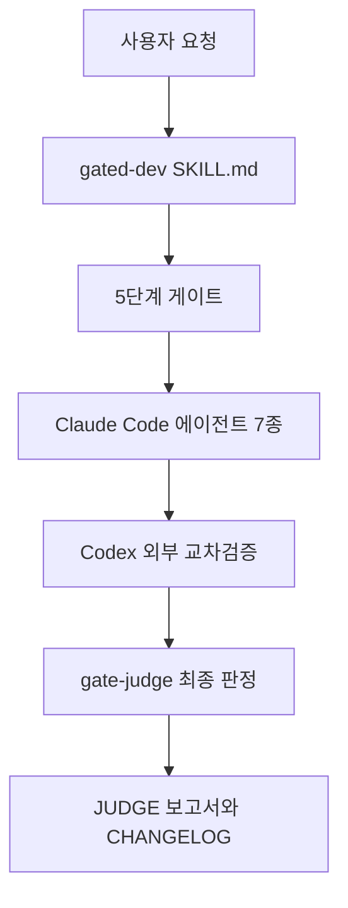
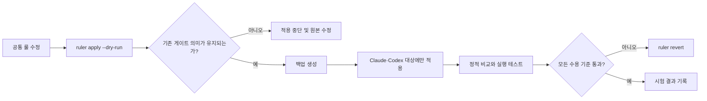
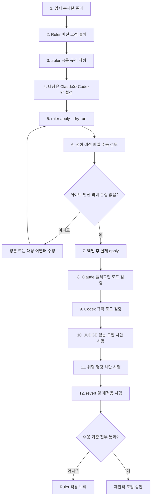
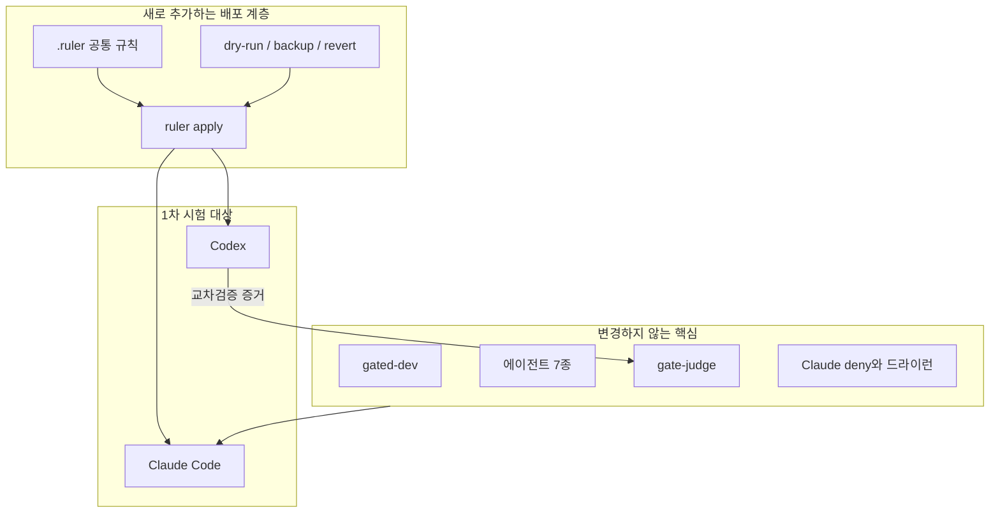

# claude-dev-standard Ruler 적용 테스트 설계

- 작성일: 2026-07-12 (KST)
- 대상 프로젝트: [solution194560/claude-dev-standard](https://github.com/solution194560/claude-dev-standard)
- 비교 대상: [intellectronica/ruler](https://github.com/intellectronica/ruler)
- 적용 범위: Ruler만 1차 시험 적용
- 문서 목적: 실제 통합 전에 장단점, 추가·제외·변경 범위와 검증 절차를 확정한다.

## 1. 결론

Ruler는 `claude-dev-standard`의 5단계 게이트를 대체하는 도구가 아니라, 동일한 규칙을 Claude Code·Codex 등 여러 AI 코딩 도구에 배포하는 **변환 계층**으로 제한해 적용하는 것이 적절하다.

1차 테스트에서는 Claude Code와 Codex 두 대상만 지원한다. Cursor·Windsurf·Gemini 등은 시험 범위에서 제외한다. 기존 Claude Code 플러그인은 그대로 유지하고, Ruler가 생성한 파일이 기존 파일을 덮어쓰거나 게이트 의미를 약화하지 않는지 검증한다.

### 권장 판정

| 항목 | 판정 |
|---|---|
| Ruler 시험 적용 | 권장 |
| 기존 플러그인 제거 | 금지 |
| 5단계 게이트 대체 | 금지 |
| Claude·Codex 동시 배포 시험 | 권장 |
| 전체 에이전트 대상 즉시 확장 | 보류 |
| 원본 프로젝트에서 바로 실행 | 비권장 |
| 임시 복제본에서 `--dry-run`부터 실행 | 필수 |

## 2. 현재 구조와 적용 후 구조

### 현재 구조



현재 구조의 중심은 Claude Code 플러그인이다. Codex는 독립 실행 주체라기보다 계획 점검과 구현 검증에 사용하는 외부 교차검증 도구다.

### Ruler 시험 적용 후 구조

```mermaid
flowchart TD
    SRC["단일 규칙 원본 .ruler"] --> R["Ruler 변환 계층"]

    R -->|"Claude 대상"| CL["CLAUDE.md 또는 Claude 규칙 파일"]
    R -->|"Codex 대상"| CX["AGENTS.md 또는 Codex 규칙 파일"]

    PL["기존 Claude 플러그인\ngated-dev + agents 7종"] --> CL

    CL --> CP["Claude 5단계 실행"]
    CX --> CR["Codex 규칙 인식 및 독립 리뷰"]

    CP --> J["gate-judge 판정"]
    CR --> EV["Codex 검증 증거"]
    EV --> J

    J --> OUT["REVIEW / VERIFY / FINAL / JUDGE"]
```



Ruler가 담당하는 것은 규칙의 배포와 대상별 형식 변환이다. 단계 실행, 테스트, 증거 수집과 최종 판정은 계속 `claude-dev-standard`가 담당한다.

## 3. 역할 경계

| 영역 | claude-dev-standard 담당 | Ruler 담당 |
|---|---:|---:|
| 5단계 프로세스 정의 | O | X |
| plan-writer 등 역할 정의 | O | 배포만 |
| gate-judge 최종 판정 | O | X |
| 테스트 원시 증거 요구 | O | 규칙 전달만 |
| Codex 교차검증 실행 | O | 실행 규칙 전달 가능 |
| 공통 규칙 단일 원본 관리 | 일부 | O |
| 대상별 규칙 파일 생성 | X | O |
| Claude·Codex 설정 변환 | 수동 | O |
| MCP 설정 배포 | 현재 핵심 아님 | 지원 가능 |
| dry-run·백업·revert | 제한적 | O |

## 4. 장점

| 장점 | 현재 문제 | Ruler 적용 효과 | 중요도 |
|---|---|---|:---:|
| 단일 규칙 원본 | 같은 안전 규칙을 여러 파일에 반복할 가능성 | `.ruler/`에서 규칙을 한 번 관리 | 높음 |
| Claude·Codex 동기화 | Claude 규칙과 Codex 지시문이 서로 달라질 수 있음 | 공통 규칙을 대상 형식으로 생성 | 높음 |
| 변경 미리보기 | 생성될 대상 파일을 수동으로 예상해야 함 | `ruler apply --dry-run`으로 확인 | 매우 높음 |
| 복원 가능성 | 설정 파일을 잘못 덮으면 수동 복원 필요 | 백업과 `ruler revert` 사용 가능 | 매우 높음 |
| 대상 선택 | 모든 도구 설정을 한꺼번에 관리하기 어려움 | `--agents claude,codex`처럼 제한 가능 | 높음 |
| 중첩 규칙 | 모노레포 하위 모듈별 안전 정책 적용이 어려움 | 디렉터리별 `.ruler/` 지원 | 중간 |
| 확장성 | 향후 Cursor·Gemini 지원 시 별도 문서 작성 필요 | 어댑터 추가로 확장 가능 | 중간 |
| 규칙 출처 추적 | 생성된 규칙이 어디서 왔는지 불명확할 수 있음 | 원본 파일 표시와 중앙 구성으로 추적 | 중간 |

## 5. 단점과 위험

| 단점 또는 위험 | 영향 | 대응 방법 | 우선순위 |
|---|---|---|:---:|
| 규칙 복제본 증가 | 원본과 생성 파일의 정본이 혼동될 수 있음 | `.ruler/`를 공통 규칙 정본으로 명시 | P0 |
| 기존 `CLAUDE.md` 덮어쓰기 가능성 | 프로젝트 프로필과 게이트 규칙 손상 | dry-run과 백업 필수, 출력 경로 분리 | P0 |
| 의미 손실 | Claude 전용 도구·모델·권한 표현이 Codex에서 달라짐 | 대상별 어댑터 규칙과 수동 검증 추가 | P0 |
| 서브에이전트 지원이 실험적 | 에이전트 7종이 완전히 변환되지 않을 수 있음 | 1차에는 에이전트 자동 변환 제외 | P0 |
| 스킬 지원이 실험적 | `gated-dev` 트리거가 대상마다 달라질 수 있음 | 기존 Claude 플러그인 유지 | P0 |
| 권한 정책 불일치 | Claude의 `tools`·`deny`가 Codex 샌드박스로 그대로 변환되지 않음 | 권한은 대상별 파일로 별도 관리 | P0 |
| 이중 관리 | 플러그인 파일과 Ruler 원본을 동시에 수정할 위험 | 정본·생성물 표와 CI 검사 추가 | P1 |
| 도구 의존성 증가 | Node와 Ruler 버전 관리 필요 | 버전 고정과 설치 확인 절차 추가 | P1 |
| 생성 파일 노이즈 | 불필요한 대상 파일과 diff 증가 | Claude·Codex만 선택 생성 | P1 |
| Ruler 변경 영향 | 새 버전에서 출력 형식이 바뀔 수 있음 | 버전 고정 후 업데이트 검증 | P1 |

## 6. 추가되는 부분

Ruler 시험 적용 시 다음 항목이 새로 추가된다.

| 추가 항목 | 목적 | 1차 테스트 포함 여부 |
|---|---|:---:|
| `.ruler/AGENTS.md` | 공통 프로젝트 규칙 정본 | 포함 |
| `.ruler/safety.md` | 전 대상 공통 안전 규칙 | 포함 |
| `.ruler/process.md` | 5단계 게이트 요약 | 포함 |
| `.ruler/evidence.md` | 원시 증거와 JUDGE 조건 | 포함 |
| `.ruler/ruler.toml` | 대상·출력·변환 설정 | 포함 |
| Claude 대상 생성 규칙 | Claude용 공통 규칙 전달 | 포함 |
| Codex 대상 생성 규칙 | Codex용 공통 규칙 전달 | 포함 |
| `ruler apply --dry-run` 검증 | 실제 쓰기 전 diff 확인 | 포함 |
| 백업·revert 시험 | 원상 복구 검증 | 포함 |
| 중첩 `.ruler/` | 모듈별 규칙 | 제외 |
| MCP 설정 변환 | 공통 MCP 배포 | 제외 |
| 스킬 자동 변환 | `gated-dev` 다중 대상 변환 | 제외 |
| 서브에이전트 자동 변환 | 7개 에이전트 변환 | 제외 |

### 권장 시험 디렉터리

```text
.ruler/
├── AGENTS.md
├── safety.md
├── process.md
├── evidence.md
└── ruler.toml
```

## 7. 제외되는 부분

다음 항목은 1차 적용 테스트에서 의도적으로 제외한다.

| 제외 항목 | 제외 이유 | 후속 조건 |
|---|---|---|
| 기존 Claude 플러그인 제거 | 현재 안정적인 실행 진입점 | Ruler 기반 스킬 변환이 검증된 뒤 재검토 |
| `agents/` 7종 자동 변환 | Ruler 서브에이전트 지원이 실험적 | 역할·도구·모델 보존 테스트 통과 후 |
| `skills/gated-dev` 자동 변환 | 트리거와 참조 경로 손실 위험 | Claude·Codex 양쪽 호출 검증 후 |
| Cursor·Windsurf·Gemini | 시험 범위가 지나치게 넓어짐 | Claude·Codex 성공 후 대상별 추가 |
| MCP 동기화 | 5단계 게이트 검증과 직접 관련 없음 | 공통 MCP 요구가 생길 때 |
| 전역 설치 | 다른 프로젝트에 영향을 줄 수 있음 | 프로젝트 로컬 시험 완료 후 |
| 실제 운영 프로젝트 적용 | 생성 파일 충돌 위험 | 임시 복제본 검증 완료 후 |
| 자동 `ruler apply` CI | 초기에는 출력이 안정됐는지 모름 | 생성 결과가 반복적으로 동일한 경우 |

## 8. 변경되는 부분

### 정본 체계 변경

| 규칙 종류 | 현재 정본 | 시험 적용 후 정본 | 비고 |
|---|---|---|---|
| 공통 안전 원칙 | `skills/gated-dev`와 `CLAUDE.md` | `.ruler/safety.md` | 생성물과 내용 일치 필요 |
| 5단계 상세 실행 | `skills/gated-dev` | 기존 파일 유지 | Ruler로 이동하지 않음 |
| 게이트 판정 로직 | `agents/gate-judge.md` | 기존 파일 유지 | 절대 변환 대상 아님 |
| 프로젝트 프로필 | `CLAUDE.md §0` | 기존 파일 유지 | Ruler가 덮어쓰면 안 됨 |
| 공통 증거 규칙 | 여러 에이전트 파일 | `.ruler/evidence.md` + 기존 역할별 상세 | 공통부만 중앙화 |
| 대상별 규칙 파일 | 수동 작성 | Ruler 생성물 | 직접 수정 금지 |
| 권한·deny | Claude settings | 대상별 네이티브 설정 | 공통 문장만 Ruler로 배포 |

### 운영 방식 변경



## 9. 변경하지 않는 부분

Ruler를 적용해도 다음 원칙은 변경하지 않는다.

1. 계획 작성 전 구현 금지
2. 계획 점검과 구현 주체 분리
3. 구현자와 검증자 분리
4. 증거 수집자와 `gate-judge` 분리
5. 원시 테스트 출력이 없으면 판정 반려
6. `_REVIEW_JUDGE.md` APPROVE 없이는 구현 금지
7. `_VERIFY_<phase>_JUDGE.md` PASS 없이는 최종 테스트 금지
8. 운영 게시·배포·데이터 변경은 드라이런까지만
9. 실제 반영은 사람이 직접 수행
10. Codex 실패 시 폴백 사실과 사유 기록

## 10. 권장 적용 플로우



## 11. 테스트 시나리오

| 번호 | 시험 | 기대 결과 | 실패 시 판정 |
|---:|---|---|---|
| 1 | `ruler apply --dry-run` | 파일을 쓰지 않고 변경 예정 내용 표시 | 적용 중단 |
| 2 | Claude·Codex만 대상 지정 | 다른 에이전트 파일 미생성 | 구성 수정 |
| 3 | 기존 `CLAUDE.md §0` 보존 | 프로젝트 프로필 내용 유지 | P0 실패 |
| 4 | 기존 플러그인 로드 | `gated-dev`와 에이전트 7종 정상 | P0 실패 |
| 5 | Codex가 공통 안전 룰 인식 | 실제 쓰기·배포 금지 확인 | P0 실패 |
| 6 | JUDGE 없는 implementer 호출 | 구현하지 않고 종료 | P0 실패 |
| 7 | VERIFY JUDGE 없는 final-tester 호출 | 테스트하지 않고 종료 | P0 실패 |
| 8 | 리뷰어 역할 실행 | 소스 수정 없이 보고서만 생성 | P0 실패 |
| 9 | 위험 명령 시험 | `--apply`, `--yes`, `git push` 차단 | P0 실패 |
| 10 | 생성 결과 반복성 | 두 번 apply 결과가 동일 | 불안정 판정 |
| 11 | `ruler revert` | 적용 전 파일 상태 복원 | 도입 보류 |
| 12 | revert 후 재적용 | 동일 결과 재생성 | 도입 보류 |
| 13 | 한글 경로 시험 | 인코딩·경로 오류 없음 | 수정 후 재시험 |
| 14 | Ruler 미설치 환경 | 기존 Claude 플러그인은 계속 동작 | 결합도 재설계 |

## 12. 수용 기준

Ruler 제한 도입은 다음 조건을 모두 만족할 때만 승인한다.

| 수용 기준 | 필수 여부 |
|---|:---:|
| 기존 Claude 플러그인이 수정 없이 로드됨 | 필수 |
| 기존 에이전트 7종의 역할과 도구가 유지됨 | 필수 |
| `gate-judge` 착수 조건이 약화되지 않음 | 필수 |
| `CLAUDE.md §0` 프로젝트 프로필이 보존됨 | 필수 |
| Claude와 Codex의 공통 안전 룰이 의미상 일치함 | 필수 |
| dry-run이 실제 파일을 수정하지 않음 | 필수 |
| 백업과 revert가 정상 작동함 | 필수 |
| 생성 파일이 반복 실행 시 안정적임 | 필수 |
| Cursor 등 추가 대상 지원 | 선택 |
| MCP 변환 | 선택 |
| 서브에이전트 자동 변환 | 선택 |

## 13. 도입 중단 조건

다음 중 하나라도 발생하면 1차 적용을 중단하고 기존 구조로 복귀한다.

- Ruler가 기존 `CLAUDE.md` 프로젝트 프로필을 덮어쓴다.
- `tools`, `deny`, 샌드박스 의미가 변환 과정에서 약해진다.
- JUDGE 판정 없이 구현 또는 최종 테스트를 시작할 수 있다.
- Claude와 Codex에서 동일한 규칙이 서로 다른 의미로 해석된다.
- 생성 파일과 원본 중 어느 것이 정본인지 구분할 수 없다.
- `ruler revert`가 기존 파일을 정확히 복구하지 못한다.
- Ruler가 설치되지 않은 환경에서 기존 플러그인까지 작동하지 않는다.
- 실험적인 스킬·서브에이전트 변환이 기존 에이전트 파일을 변경한다.

## 14. 권장 1차 적용안

### 포함

- 프로젝트 로컬 `.ruler/`
- 공통 안전 규칙
- 5단계 프로세스 요약
- 원시 증거·JUDGE 착수 조건
- Claude 대상 규칙 생성
- Codex 대상 규칙 생성
- dry-run
- 백업
- revert

### 제외

- 기존 플러그인 제거
- 에이전트 7종 자동 변환
- `gated-dev` 스킬 자동 변환
- MCP 동기화
- 중첩 규칙
- Claude·Codex 외 대상
- 전역 설치

### 최종 구조



## 15. 최종 판단

Ruler만 먼저 적용 테스트하는 결정은 적절하다. 세 후보 중 Ruler가 사용자의 목적과 가장 직접적으로 맞으며, 기존 5단계 게이트를 유지하면서 Claude와 Codex의 공통 규칙을 중앙 관리할 수 있기 때문이다.

다만 1차 적용의 목표는 “모든 AI 도구 지원”이 아니다. 성공 기준은 다음 한 문장으로 제한해야 한다.

> 기존 `claude-dev-standard`의 게이트와 안전 수준을 전혀 낮추지 않고, 공통 규칙을 Claude와 Codex 두 대상에 반복 가능하고 복원 가능한 방식으로 배포한다.

이 기준을 충족한 이후에만 스킬·서브에이전트 자동 변환과 추가 AI 도구 지원을 검토한다.
