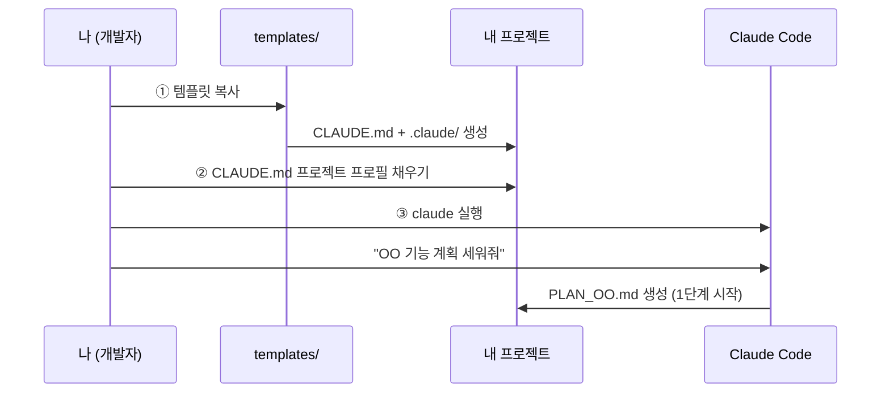

# 01. 빠른 시작 (Quickstart) — 10분

Claude Code를 처음 세팅하고 5단계 게이트 개발을 시작하기까지의 전체 절차입니다.



---

## 사전 준비

| 항목 | 확인 방법 |
|---|---|
| Claude Code 설치 | 터미널에서 `claude --version` |
| 내 프로젝트 폴더 | 새 폴더도 가능 (git init 권장) |
| (권장) 외부 점검 도구 | Codex CLI — 점검·검증 교차 검증의 기본 경로. 없어도 동작함(자동 폴백) ([03_agents.md](03_agents.md#외부-점검-도구-연동-기본-권장--codex-cli) 참조) |

## ① 템플릿 복사

이 킷의 `templates/` 내용을 **내 프로젝트 루트**로 복사합니다.

**PowerShell (Windows):**
```powershell
$KIT = "경로\claude-dev-standard"     # 이 킷의 위치
$PROJ = "경로\my-project"             # 내 프로젝트

Copy-Item "$KIT\templates\CLAUDE.md.template" "$PROJ\CLAUDE.md"
Copy-Item "$KIT\templates\.claude" "$PROJ\.claude" -Recurse
Rename-Item "$PROJ\.claude\settings.json.example" "settings.json"
```

**bash (macOS/Linux):**
```bash
KIT=경로/claude-dev-standard
PROJ=경로/my-project

cp "$KIT/templates/CLAUDE.md.template" "$PROJ/CLAUDE.md"
cp -r "$KIT/templates/.claude" "$PROJ/.claude"
mv "$PROJ/.claude/settings.json.example" "$PROJ/.claude/settings.json"
```

복사 후 내 프로젝트 구조:
```
my-project/
├── CLAUDE.md              ← ②에서 채울 파일
└── .claude/
    ├── settings.json      ← 권한 설정 (필요 시 수정)
    └── agents/            ← 서브에이전트 5종 (수정 불필요)
        ├── plan-writer.md
        ├── plan-reviewer.md
        ├── implementer.md
        ├── impl-verifier.md
        └── final-tester.md
```

## ② CLAUDE.md 채우기 (가장 중요)

`CLAUDE.md`를 열면 맨 위에 **"프로젝트 프로필"** 섹션이 있습니다.
`{{ }}` 로 표시된 부분을 내 프로젝트 값으로 바꾸세요.
**에이전트들은 이 프로필을 읽고 동작하므로, 여기만 채우면 에이전트 파일은 수정할 필요가 없습니다.**

| 치환 지점 | 의미 | 예시 |
|---|---|---|
| `{{프로젝트명}}` | 프로젝트 이름 | `주문관리시스템` |
| `{{프로젝트 개요}}` | 한 문단 설명 | `사내 주문 티켓 자동 분류 시스템` |
| `{{실행 명령}}` | 앱/파이프라인 실행 | `.venv\Scripts\python.exe main.py` |
| `{{테스트 명령}}` | 오프라인 테스트 | `.venv\Scripts\python.exe -m pytest tests/ -v` |
| `{{위험 작업 목록}}` | 실쓰기(운영 반영) 명령과 게이트 | `post_comments.py --apply (댓글 실게시)` |
| `{{외부 점검 도구}}` | (선택) Codex 등 점검 CLI 실행 명령 | 없으면 `없음` 이라고 적기 |

> 💡 아직 프로젝트가 비어 있다면(코드가 없다면) 실행/테스트 명령은 대략 정하고,
> 첫 번째 PLAN에서 확정해도 됩니다.

## ③ 첫 실행

프로젝트 폴더에서 Claude Code를 실행하고, 5단계 프로세스를 시작합니다:

```
> claude

# 1단계: 계획
"로그인 기능 개발 계획 세워줘"           → plan-writer가 PLAN_로그인.md 작성

# 2단계: 점검
"plan-reviewer로 PLAN_로그인.md 점검해줘" → APPROVE 나올 때까지 수정

# 3단계: 구현
"PLAN_로그인.md Phase A 구현해줘"        → implementer가 코드 작성

# 4단계: 검증
"impl-verifier로 구현 검증해줘"          → PASS/FAIL 판정

# 5단계: 최종 테스트
"final-tester로 최종 테스트해줘"         → DONE이면 완료 🎉
```

각 단계에서 무엇이 만들어지고 어떤 판정이 나와야 다음으로 가는지는
[02_process.md](02_process.md)를 보세요.

## 자주 묻는 것

**Q. 에이전트 파일(.claude/agents/)을 수정해야 하나요?**
아니요. 프로젝트 고유 정보는 전부 CLAUDE.md 프로필에서 읽습니다.
모델을 바꾸고 싶을 때만 frontmatter의 `model:`을 수정하세요 ([03_agents.md](03_agents.md) 참조).

**Q. 간단한 버그 수정도 5단계를 다 거쳐야 하나요?**
아니요. 단건 수정 경로(구현 → 테스트 → 실데이터 확인)가 있습니다 — [02_process.md](02_process.md#5단계를-생략할-수-있는-경우) 참조.

**Q. settings.json은 뭘 하는 파일인가요?**
Claude Code의 도구 사용 권한(자동 허용/차단 목록)입니다. 기본 예시는 테스트 실행 정도만
자동 허용합니다. 팀 공유용은 `settings.json`, 개인용은 `settings.local.json`(git 제외)을 쓰세요.

**Q. 작업을 하다가 세션을 닫아야 하면?**
"SESSION.md에 체크포인트 남겨줘"라고 한 뒤 닫고, 다음 세션에서 "SESSION.md 읽고
이어서 진행해줘"로 재개하세요 — [05_session.md](05_session.md) 참조.

**Q. 토큰 비용이 걱정돼요.**
모델 티어 분배·CLAUDE.md 얇게 유지·대화 습관 세 가지만 지키면 됩니다 —
[06_cost.md](06_cost.md) 참조 (Codex 연동도 비용 분산 효과가 있습니다).
