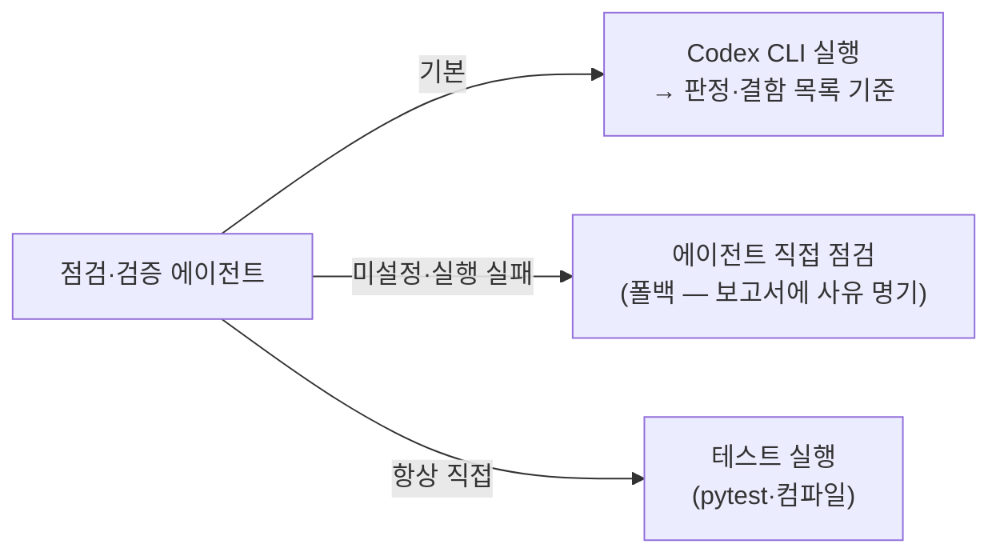

# 03. 서브에이전트 5종

`.claude/agents/`에 있는 5개 에이전트가 5단계 프로세스의 각 단계를 담당합니다.
에이전트는 프로젝트 고유 정보(실행/테스트 명령, 위험 작업)를 **CLAUDE.md의
"프로젝트 프로필" 섹션에서 읽으므로**, 에이전트 파일 자체는 수정 없이 재사용됩니다.

## 한눈에 보기

| # | 에이전트 | 기본 모델 | 역할 | 산출물 | 소스 수정 |
|---|---|---|---|---|---|
| 1 | plan-writer | Opus | 계획 문서 작성 | `PLAN_*.md` | ❌ |
| 2 | plan-reviewer | Opus | 계획 비판적 점검 | `*_REVIEW.md` (APPROVE/REVISE) | ❌ |
| 3 | implementer | Sonnet | 계획대로 구현 | 코드 + CHANGELOG | ✅ |
| 4 | impl-verifier | Opus | 구현 검증 + 테스트 직접 실행 | `*_VERIFY_*.md` (PASS/FAIL) | ❌ |
| 5 | final-tester | Sonnet | 실데이터 e2e 최종 테스트 | `*_FINAL_*.md` (DONE/BLOCKED) | ❌ (CHANGELOG만) |

> 역할 분리 원칙: **점검/검증/테스트 에이전트는 절대 소스를 고치지 않습니다.**
> 결함은 보고만 하고, 수정은 항상 implementer가 합니다. (심판과 선수의 분리)

## 호출 방법

Claude Code 대화에서 자연어로 부르면 됩니다:

```
"로그인 기능 계획 세워줘"                    → plan-writer
"plan-reviewer로 PLAN_로그인.md 점검해줘"    → plan-reviewer
"PLAN_로그인.md Phase A 구현해줘"            → implementer
"impl-verifier로 Phase A 구현 검증해줘"      → impl-verifier
"final-tester로 최종 테스트해줘"             → final-tester
```

## 에이전트 파일 구조 (수정하고 싶을 때)

각 에이전트는 마크다운 + frontmatter입니다:

```markdown
---
name: plan-writer                # 호출 이름
description: "[1/5 계획 수립] ..." # Claude가 언제 이 에이전트를 쓸지 판단하는 설명
model: claude-opus-4-8           # 사용할 모델 ← 여기만 바꾸면 모델 교체
tools: Read, Grep, Glob, Write, Edit   # 허용 도구 (최소 권한)
---
(이하 에이전트 지시문)
```

**모델 교체**: `model:` 값만 수정. 판단이 중요한 단계(계획·점검·검증)는 상위 모델,
실행 중심 단계(구현·테스트)는 속도 좋은 모델을 권장합니다.

**도구 목록의 정본은 각 에이전트 파일의 frontmatter입니다.** 이 문서와 [00_files.md](00_files.md)의
설명은 사본이므로, 어긋나면 frontmatter를 믿으세요.

**도구 제한은 안전장치의 일부일 뿐입니다**: 점검·검증 계열에 `Edit`가 없는 것은 의도된
설계지만, **소스 수정을 도구 수준에서 막지는 못합니다** — `Write`는 파일을 통째로 덮어쓸 수
있고 `Bash`가 있으면 `sed -i` 한 줄이면 됩니다. 소스 수정 금지는 결국 **지시문으로 지키는
규칙**입니다. 임의로 `Edit`를 추가하지 마세요(방어가 한 겹 더 얇아집니다).
예외는 final-tester 하나입니다 — DONE 판정 시 CHANGELOG.md 에 한 줄을 덧붙여야 하므로
`Edit`를 갖되, 지시문에서 **CHANGELOG 전용**으로 못박았습니다.

## 외부 점검 도구 연동 (기본 권장) — Codex CLI

2단계(계획 점검)와 4단계(구현 검증)는 **독립된 외부 리뷰어**(OpenAI Codex CLI)를
기본으로 씁니다. 같은 모델이 쓴 코드를 같은 모델이 검토할 때 생기는 편향을 줄이고
(교차 검증), 리뷰 분량만큼 Claude 토큰도 아낍니다([06_cost.md](06_cost.md)).
**연동하지 않아도 킷은 정상 동작**합니다 — 아래 "Codex 없이 쓸 때" 참조.



### 최초 설정 (한 번만)

**① 설치 확인**

macOS / Linux:
```bash
codex --version
```

Windows (PowerShell):
```powershell
& "$env:LOCALAPPDATA\Programs\OpenAI\Codex\bin\codex.exe" --version
```

버전이 나오면 OK. 없으면 Codex CLI 설치 후 `codex login`까지 마치세요.

> **macOS에서 `codex not found`가 뜬다면** — ChatGPT 데스크톱 앱을 설치한 경우
> Codex CLI가 앱 번들 안에 들어 있고 PATH에는 노출되지 않습니다. 이때는 절대경로를
> 쓰거나, 아래처럼 PATH에 심볼릭 링크를 걸어두면 이후 예시를 그대로 쓸 수 있습니다.
> ```bash
> ls "/Applications/ChatGPT.app/Contents/Resources/codex"   # 존재 확인
> sudo ln -s "/Applications/ChatGPT.app/Contents/Resources/codex" /usr/local/bin/codex
> ```
> `/usr/local/bin`은 보통 쓰기에 `sudo`가 필요합니다. 앱을 업데이트하면 링크가
> 끊길 수 있으니, 끊기면 `codex --version`으로 확인하고 다시 걸어주세요.

**② Windows 전용 필수 설정 — 무응답 예방**

> macOS·Linux 사용자는 이 단계를 건너뛰세요. `[windows]` 섹션은 적용되지 않습니다.

`~/.codex/config.toml`(= `C:\Users\<사용자>\.codex\config.toml`)에 다음이 있어야 합니다:
```toml
[windows]
sandbox = "unelevated"
```
이 값이 `elevated`면 `ShellExecuteExW 1223` 오류로 **응답 없이 멈춥니다.**
Windows에서 Codex가 무응답이면 항상 이 값부터 확인하세요.

**③ CLAUDE.md 프로필에 실행 명령 기재**

지시문을 파일로 저장한 뒤 stdin 으로 파이프합니다(특수문자·인코딩 깨짐 방지).

macOS / Linux (`codex`가 PATH에 없으면 그 자리에 절대경로를 넣으세요):
```bash
cat "<지시문파일>" |
  codex exec --skip-git-repo-check -C "<프로젝트 루트>" --sandbox read-only -
```

Windows (PowerShell):
```powershell
Get-Content <지시문파일> -Raw -Encoding UTF8 |
  & "$env:LOCALAPPDATA\Programs\OpenAI\Codex\bin\codex.exe" exec `
    --skip-git-repo-check -C "<프로젝트 루트>" --sandbox read-only -
```

여기까지 하면 끝 — 이후에는 평소처럼 `"plan-reviewer로 점검해줘"` /
`"impl-verifier로 검증해줘"`만 부르면 에이전트가 알아서 Codex를 구동합니다.

### 연동 시 주의

- 점검은 읽기만 필요 — `--sandbox read-only` 유지 (전체 접근 불필요)
- `codex exec`는 기본이 비대화형 — `--ask-for-approval` 플래그를 넣지 말 것(무효 인자 에러)
- **테스트 실행은 외부 도구와 무관하게 항상 에이전트가 직접** 수행합니다
  (외부 리뷰가 PASS여도 테스트가 깨지면 FAIL)

### 문제 해결

| 증상 | 플랫폼 | 확인할 것 |
|---|---|---|
| 응답 없이 멈춤 | Windows | `~/.codex/config.toml`의 `[windows] sandbox = "unelevated"` 인지 |
| 명령을 못 찾음 | macOS·Linux | `which codex` 확인. 안 잡히면 ChatGPT 데스크톱 앱 번들 경로(`/Applications/ChatGPT.app/Contents/Resources/codex`)를 쓰거나 심볼릭 링크 |
| 명령을 못 찾음 | Windows | `%LOCALAPPDATA%\Programs\OpenAI\Codex\bin`에 codex.exe 있는지 |
| 인증 오류 | 공통 | `codex login` 재실행 |
| 한글 깨짐 | 공통 | 지시문을 UTF-8 파일로 저장 후 stdin 파이프 방식인지 |

### Codex 없이 쓸 때 (폴백 경로)

Codex가 없어도 **게이트는 생략되지 않습니다** — 검증 주체만 바뀝니다.

- **설정 자체를 안 한 경우**: CLAUDE.md 프로필의 `외부 점검 도구`에 `없음`이라고
  적으세요. 점검·검증 에이전트가 처음부터 직접 비판적 점검을 수행합니다.
- **설정했는데 실행이 실패한 경우**: 에이전트가 자동으로 직접 점검(폴백)하고
  보고서 맨 위에 실패 사유를 명시합니다. 따로 해줄 일 없습니다.
- **이번 한 번만 빼고 싶은 경우**: 호출할 때 한 마디 —
  `"impl-verifier로 검증해줘 — 외부 도구 없이 직접 점검으로"`

폴백 시 알아둘 것:
- 테스트 실행(pytest·컴파일)은 폴백이어도 그대로 수행됩니다.
- 다만 같은 Claude 계열이 검증하므로 **교차 검증 이점은 줄어듭니다.**
  중요 변경(정책 파일·실쓰기 경로·보안 로직)은 가급적 Codex 경로를 권장.
- Codex가 복구되면 `"지난 <보고서명>을 외부 도구로 재검증해줘"`로
  사후 교차 검증이 가능합니다.

## 공통 금지 사항 (모든 에이전트)

1. **외부 시스템 실제 쓰기 금지** — CLAUDE.md 프로필의 "위험 작업 목록"에 있는
   명령(운영 데이터 변경·게시·배포)은 드라이런까지만. 확인 프롬프트(`[y/N]`)에
   `y`로 응답하는 것도 금지.
2. **게이트 건너뛰기 금지** — 이전 단계 판정이 통과가 아니면 착수하지 않고 보고 후 종료.
3. **역할 밖 행동 금지** — 점검자가 코드를 고치거나, 구현자가 다음 Phase를 앞당기지 않음.
