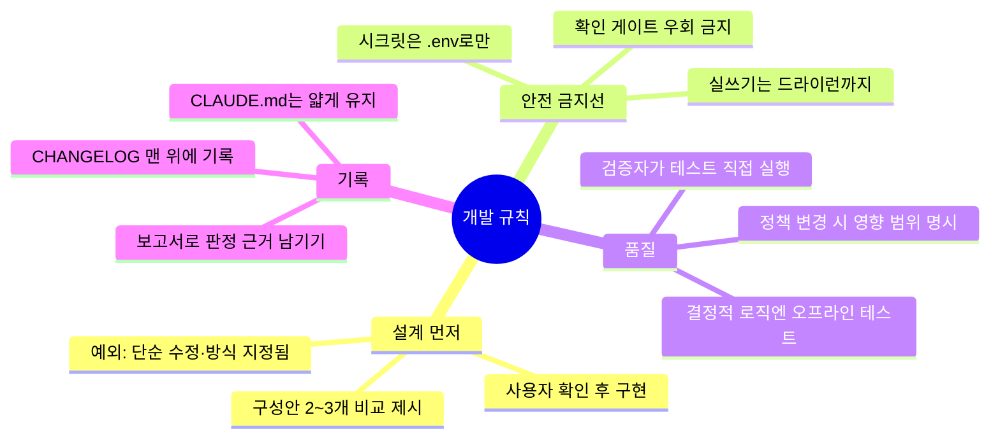

# 04. 개발 규칙 (Development Rules)

에이전트와 사람 모두에게 적용되는 프로젝트 공통 규칙입니다.
CLAUDE.md 템플릿에 이미 포함되어 있으며, 여기서는 각 규칙의 **이유**를 설명합니다.

## 규칙 지도

## 1. 설계 먼저 (Design Before Code) — 무조건 준수

새 소스(스크립트/모듈/함수)를 만들 때:

1. **최선의 방안 2~3가지**를 구성(파일 배치·함수 구조·동작 흐름)과 함께 제시
2. 각 안의 **장단점을 표로 비교**
3. 사용자 확인(방안 선택)을 받은 **후에** 코드 작성

**Why**: 구현 후 방향을 되돌리는 것이 가장 큰 낭비. 설계 검토 5분이 재작업 5시간을 막는다.

**예외** (이때는 단일안만 제시하고 확인):
- 방안이 사실상 1개뿐인 단순 수정
- 사용자가 이미 방식을 구체적으로 지정한 경우

기존 코드 조회·분석(Read/Grep)은 확인 없이 진행해도 됩니다.

## 2. 안전 금지선 (Safety Lines)

| 금지 | 내용 |
|---|---|
| 실쓰기 | 운영 시스템에 실제 반영되는 명령(`--apply` 류, 게시·배포·데이터 변경)은 에이전트가 실행 금지 — **드라이런까지만**. 실쓰기는 사람이 결과를 검토한 뒤 직접 실행 |
| 게이트 우회 | 드라이런 기본값이나 `[y/N]` 확인 프롬프트를 우회하는 코드를 만들지 않음 |
| 시크릿 | 비밀번호·토큰은 `.env`(git 제외)에만. 코드·문서·AI 프롬프트에 시크릿 금지 |

**Why**: AI 개발 보조의 사고는 대부분 "실수로 운영에 썼다"에서 나온다.
쓰기 전 단계(드라이런)까지 자동화하고, 마지막 방아쇠는 사람이 당긴다.

### 지시문과 강제는 다르다

위 금지선은 **두 겹**으로 지킨다.

| 겹 | 어디에 | 성격 |
|---|---|---|
| 지시문 | `CLAUDE.md §0` 위험 작업 목록 | 에이전트가 읽고 지키는 규칙 |
| 강제 | `.claude/settings.json` 의 `deny` | 도구 호출 자체를 차단 |

`deny` 는 `allow` 보다 **먼저** 평가되므로 `allow` 에 넓은 규칙이 있어도 이긴다
(예: `allow` 에 `Read(**)` 가 있어도 `deny` 의 `Read(.env)` 가 우선한다).
킷의 기본 `deny` 는 위 금지선 3가지에 1:1로 대응한다.

- 실쓰기 — `Bash(*--apply*)`, `Bash(*--no-dry-run*)`, `Bash(git push*)`
- 게이트 우회 — `Bash(*--yes*)` (확인 프롬프트 자동 승인)
- 시크릿 — `Read(.env)`, `Edit(.env)` 및 `.env.*`

규칙을 읽을 때 알아둘 두 가지.

- **`Edit(...)` 는 `Edit`·`Write`·`NotebookEdit` 세 도구를 모두 덮는다.** `Write(...)`
  라는 별도 규칙은 없다. 그래서 `Edit(.env)` 하나로 덮어쓰기까지 막힌다.
- **바 파일명은 gitignore 의미론을 따라 모든 깊이에 매칭된다.** `Read(.env)` 와
  `Read(**/.env)` 는 동치이므로 둘 다 적을 필요가 없다.

**§0 위험 작업 목록에 명령을 추가하면 `deny` 에도 같이 추가한다.** 한쪽만 고치면
지시문만 남고 강제는 사라진다.

**부작용 — `Bash(*--yes*)`**: `npm install --yes`, `gh pr create --yes` 같은 무해한
명령도 함께 막힌다. 확인 프롬프트 자동 승인을 막는 것이 목적이므로 기본값으로 두되,
막히는 명령이 잦으면 그 명령만 `allow` 에 구체적으로 적어 예외를 만든다
(`deny` 가 우선이므로 `deny` 쪽 패턴을 좁히는 편이 확실하다).

**한계 — 과신하지 말 것**:
- `deny` 는 Claude Code 가 스스로 지키는 규칙이지 OS 수준 격리가 아니다.
  진짜 격리가 필요하면 샌드박스를 함께 쓴다.
- 셸 우회(`sh -c "..."`, `yes | cmd`, 변수 치환)까지 막히는지는 보장되지 않는다.
- `.env` 차단은 Claude 의 내장 도구에 적용된다. 파이썬 스크립트가 스스로 파일을
  여는 것까지는 막지 못한다.
- 그래서 **최종 방아쇠는 여전히 사람**이다. `deny` 는 실수를 줄이지 없애지 않는다.

## 3. 품질 규칙

- **결정적 로직에는 오프라인 테스트**: 키워드 판정·규칙 엔진 등 LLM/네트워크 없이
  검증 가능한 로직은 pytest 기반 테스트를 반드시 추가. 회귀(regression)의 방파제.
- **검증자가 테스트를 직접 실행**: 구현자의 "테스트 통과했다"는 보고를 그대로 믿지 않는다.
  4단계 검증자가 전체 테스트를 재실행하고, 실패 시 무조건 FAIL.
- **정책/설정 파일 변경 시 영향 범위 명시**: 설정 하나가 여러 케이스의 판정을 바꿀 수
  있으므로, 어떤 대상에 어떤 판정 변화가 생기는지 CHANGELOG에 기록.
- **오탐(false positive/negative) 수정 시**: 실제 사례를 재현하는 테스트를 함께 추가
  (예: "티켓 X 재현 테스트"). 같은 오탐의 재발을 테스트가 막는다.

## 4. 기록 규칙

- **CHANGELOG.md 맨 위에 기록**: 작업 완료마다 최신이 위로. 포함할 것 —
  무엇을/왜(원인·배경)/어떻게(파일·함수)/검증 결과(테스트 수치·실데이터 확인).
- **CLAUDE.md는 얇게 유지**: CLAUDE.md는 매 대화마다 자동 로드되어 토큰을 소모한다.
  과거 이력은 CHANGELOG.md로, 현재 유효한 규칙·정책만 CLAUDE.md에 남긴다.
- **판정은 보고서로**: 점검(REVIEW)·검증(VERIFY)·최종(FINAL) 판정과 근거는 파일로
  남긴다. "누가 언제 무엇을 근거로 통과시켰나"를 추적 가능하게.

## 5. 협업 시 권장 사항

- `.claude/settings.json`(팀 공유)과 `.claude/settings.local.json`(개인, git 제외)을 구분
- `.gitignore`에 최소: `.env`, `.claude/settings.local.json`, 로컬 산출물 폴더
- PLAN/REVIEW/VERIFY/FINAL 보고서는 커밋에 포함 — 의사결정 이력이 곧 문서
