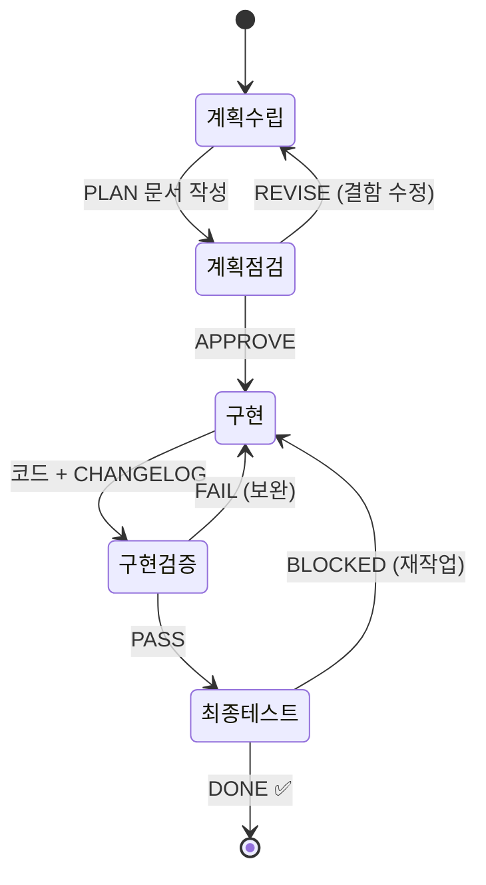
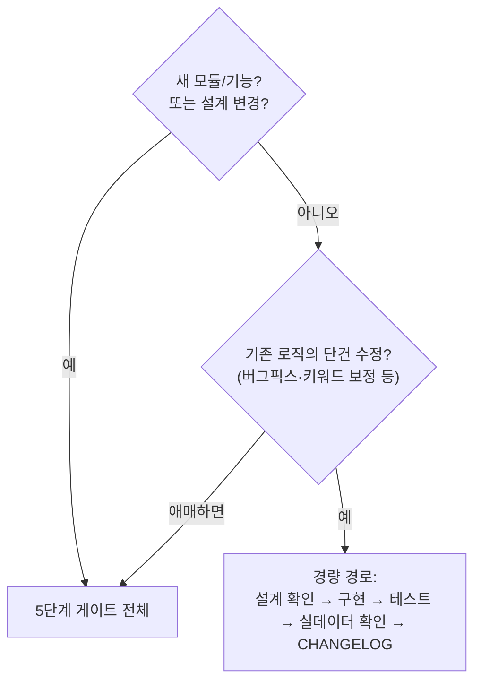
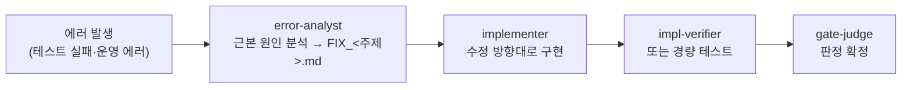

# 02. 개발 프로세스 — 5단계 게이트 상세

새 기능/개편은 5단계 게이트로 진행합니다. 핵심 규칙은 하나입니다:

> **각 단계의 산출물 판정이 "통과"일 때만 다음 단계로 진행한다.**

게이트(2·4·5단계)에서 **판정을 내리는 주체와 증거를 모으는 주체는 다릅니다.** 점검·검증·
최종 테스트 에이전트는 증거를 모아 **권고**(APPROVE/PASS/DONE 권고 등)만 하고, 최종 판정은
**gate-judge**가 확정합니다. 증거를 만든 에이전트가 스스로 채점하지 못하게 하는 장치입니다.
gate-judge는 ① 원시 증거(테스트 출력·외부 도구 응답 원문)가 없으면 반려, ② 테스트 실패·
외부 도구 반려·안전 위반이 있으면 즉시 반려, ③ 그 뒤에야 남은 결함으로 뉘앙스 판단을 합니다.

## 전체 흐름



## 단계별 규칙

### 1️⃣ 계획 수립 (plan-writer)
- **산출물**: `PLAN_<주제>.md` — 프로젝트 루트에 저장
- 계획 문서는 **자기완결적**이어야 함: 이 문서만 읽고 점검자가 점검하고 구현자가
  구현할 수 있어야 함 (대화 맥락 의존 금지)
- 필수 포함: 배경/목표, 현재 코드 상태(사실 기반), 상세 설계, Phase 분할,
  테스트·수용 기준(오프라인/실데이터 구분), **"점검 시 확인 요청 사항"** 목록
- 이 단계에서 코드 작성 금지 — 문서에 "계획 단계 — 구현 금지" 상태 표기

### 2️⃣ 계획 점검 (plan-reviewer) — 게이트 ①
- **산출물**: `PLAN_<주제>_REVIEW.md` / **권고: APPROVE 또는 REVISE** → gate-judge가
  `PLAN_<주제>_REVIEW_JUDGE.md`로 **판정 확정**
- 점검 관점: 사실 대조(계획의 전제가 실제 코드와 일치?), 기존 정책과 충돌,
  완결성(이 문서만으로 구현 가능?), 위험(데이터 손상·롤백), 테스트 검증 가능성
- REVISE면 → 1단계로 돌아가 계획을 수정하고 **재점검** (APPROVE까지 반복)
- 외부 점검 도구(Codex 등)가 설정돼 있으면 그 결과가 판정 기준 ([agents.md](agents.md) 참조)

### 3️⃣ 구현 (implementer)
- **착수 조건: `_REVIEW_JUDGE.md`의 확정 판정이 APPROVE** (gate-judge 확정) —
  JUDGE 파일이 없거나 APPROVE가 아니면 구현하지 않고 보고 후 종료.
  REVIEW의 권고만으로는 착수하지 않음
- 지시받은 Phase 범위만 구현 (다음 Phase 선행 금지)
- 계획과 다르게 해야 할 사정이 생기면 임의 변경 금지 — 편차를 보고서에 명시,
  중대한 편차면 중단·보고
- 새 결정적 로직에는 오프라인 테스트(pytest 등) 추가 의무
- 완료 전 자체 검증: 컴파일 통과 + 전체 테스트 PASS + Phase 수용 기준 확인
- 완료 시 **CHANGELOG.md 맨 위에 기록**

### 4️⃣ 구현 검증 (impl-verifier) — 게이트 ②
- **산출물**: `PLAN_<주제>_VERIFY_<phase>.md` / **권고: PASS 또는 FAIL** → gate-judge가
  `..._VERIFY_<phase>_JUDGE.md`로 **판정 확정**
- 계획 대비 대조: 설계·데이터 계약대로 구현됐는가, 계획 범위 밖 무단 변경(scope creep) 없는가
- **테스트는 반드시 검증자가 직접 실행** (구현자의 "통과했다" 보고를 신뢰하지 않음)
- 테스트 출력 **원문**을 보고서에 첨부 — 없으면 gate-judge가 "증거 불충분"으로 반려
- 테스트가 실패하면 다른 판정 근거가 어떻든 **최종 FAIL**
- 안전 규칙 감사: 실쓰기 게이트(드라이런 기본값·확인 프롬프트) 우회 경로가 생겼는지 확인 — 위반 = 즉시 FAIL
- 검증자는 소스 수정 금지 — 결함은 보고만 (수정은 implementer의 몫)

### 5️⃣ 최종 테스트 (final-tester) — 게이트 ③
- **착수 조건: `_VERIFY_<phase>_JUDGE.md`의 확정 판정이 PASS** (gate-judge 확정) —
  JUDGE 파일이 없거나 PASS가 아니면 테스트하지 않고 보고 후 종료.
  VERIFY의 권고만으로는 착수하지 않음
- **산출물**: `PLAN_<주제>_FINAL_<phase>.md` / **권고: DONE 또는 BLOCKED** → gate-judge가
  `..._FINAL_<phase>_JUDGE.md`로 **판정 확정**
- 사용자 관점의 실데이터 e2e: 읽기 작업은 실제 실행, **쓰기 작업은 드라이런까지만**
- DONE 확정 시 CHANGELOG.md 해당 기록에 "최종 테스트 통과(날짜)" 추가 — 이 기록은
  **gate-judge가** 담당한다(final-tester는 CHANGELOG를 건드리지 않음)

## 산출물 명명 규칙

```
PLAN_<주제>.md                 ← 1단계 계획
PLAN_<주제>_REVIEW.md          ← 2단계 점검 보고서(권고)
PLAN_<주제>_REVIEW_JUDGE.md    ← 2단계 판정 확정(gate-judge)
PLAN_<주제>_VERIFY_<phase>.md  ← 4단계 검증 보고서(권고)
..._VERIFY_<phase>_JUDGE.md    ← 4단계 판정 확정(gate-judge)
PLAN_<주제>_FINAL_<phase>.md   ← 5단계 최종 테스트 보고서(권고)
..._FINAL_<phase>_JUDGE.md     ← 5단계 판정 확정(gate-judge)
FIX_<주제>.md                  ← 에러 대응 경로의 분석 문서(error-analyst)
```

한 계획을 Phase A/B/C로 나눠 구현하면 Phase마다 3→4(→판정)→5(→판정)를 반복합니다.

## 5단계를 생략할 수 있는 경우



**경량 경로에서도 지켜야 하는 것** (생략 불가):
1. 소스 작성 전 설계(방안) 제시 → 사용자 확인
2. 오프라인 테스트 추가·전체 통과
3. 실데이터(또는 실제 케이스)로 수정 효과 확인
4. CHANGELOG.md 맨 위 기록

## 에러 대응 경로 (5단계와 별개)

테스트 실패나 운영 에러는 5단계 게이트가 아니라 전용 경로로 처리합니다:



- **error-analyst는 코드를 고치지 않습니다** — 근본 원인과 수정 방향만 문서로 냅니다.
  수정은 implementer의 몫입니다(심판과 선수의 분리).
- 원인이 불명확하면 추측하지 말고 읽기 전용 진단(로그·컴파일·드라이런)으로 상태를 확인합니다.
