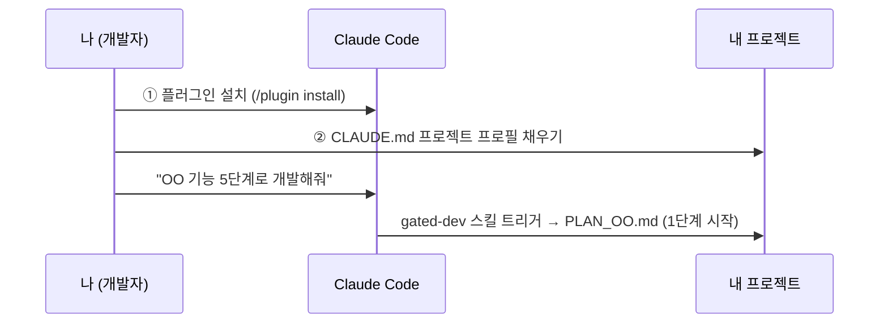

# 01. 빠른 시작 (Quickstart) — 5분

플러그인을 설치하고 5단계 게이트 개발을 시작하기까지의 절차입니다.



---

## 사전 준비

| 항목 | 확인 방법 |
|---|---|
| Claude Code 설치 | 터미널에서 `claude --version` |
| 내 프로젝트 폴더 | 새 폴더도 가능 (git init 권장) |
| (권장) 외부 점검 도구 | Codex CLI — 점검·검증 교차 검증의 기본 경로. 없어도 동작함(자동 폴백) ([agents.md](agents.md#외부-점검-도구-연동-기본-권장--codex-cli) 참조) |

## ① 플러그인 설치

Claude Code에서 마켓플레이스를 추가하고 설치합니다.

```
/plugin marketplace add solution194560/claude-dev-standard
/plugin install claude-dev-standard
```

설치하면 스킬 `gated-dev`와 에이전트 7종(plan-writer·plan-reviewer·implementer·
impl-verifier·final-tester·gate-judge·error-analyst)이 함께 등록됩니다. 프로젝트마다
따로 복사할 필요가 없습니다 — 설치는 한 번, 모든 프로젝트에서 씁니다.

## ② CLAUDE.md 프로필 채우기 (가장 중요)

에이전트들은 프로젝트 고유 정보를 **프로젝트 루트 `CLAUDE.md`의 §0 프로젝트 프로필**에서
읽습니다. 프로젝트에 `CLAUDE.md`가 없으면 [templates/CLAUDE.md.template](../../../templates/CLAUDE.md.template)을
복사해 만들고, `{{ }}` 부분을 내 값으로 바꾸세요. **여기만 채우면 에이전트는 수정할 필요가 없습니다.**

| 치환 지점 | 의미 | 예시 |
|---|---|---|
| `{{프로젝트명}}` | 프로젝트 이름 | `주문관리시스템` |
| `{{프로젝트 개요}}` | 한 문단 설명 | `사내 주문 티켓 자동 분류 시스템` |
| `{{실행 명령}}` | 앱/파이프라인 실행 | `.venv/bin/python main.py` (Windows: `.venv\Scripts\python.exe main.py`) |
| `{{테스트 명령}}` | 오프라인 테스트 | `.venv/bin/python -m pytest tests/ -v` |
| `{{위험 작업 목록}}` | 실쓰기(운영 반영) 명령과 게이트 | `post_comments.py --apply (댓글 실게시)` |
| `{{외부 점검 도구}}` | (선택) Codex 등 점검 CLI 실행 명령 | 없으면 `없음` 이라고 적기 |

> 💡 아직 프로젝트가 비어 있다면(코드가 없다면) 실행/테스트 명령은 대략 정하고,
> 첫 번째 PLAN에서 확정해도 됩니다.

권한 설정(`.claude/settings.json`)이 필요하면 [templates/.claude/settings.json.example](../../../templates/.claude/settings.json.example)을
참고하세요 — `deny`가 킷의 안전 금지선(실쓰기·게이트 우회·시크릿)을 강제합니다.

## ③ 첫 실행

프로젝트 폴더에서 Claude Code를 실행하고, 자연어로 시작합니다. `gated-dev` 스킬이
트리거되어 5단계를 오케스트레이션합니다.

```
> claude

"로그인 기능 5단계로 개발해줘"
```

스킬이 단계를 순서대로 밟습니다(각 단계 시작 전 모델 코멘트, 종료 후 토큰 보고).

```
1 계획      plan-writer   → PLAN_로그인.md
2 점검      plan-reviewer → _REVIEW.md (권고)
  판정      gate-judge    → _REVIEW_JUDGE.md (APPROVE/REVISE 확정) — REVISE면 1로
3 구현      implementer   → 코드 + CHANGELOG
4 검증      impl-verifier → _VERIFY.md (권고, 테스트 원문 첨부)
  판정      gate-judge    → PASS/FAIL 확정 — FAIL이면 3으로
5 최종      final-tester  → _FINAL.md (권고, 쓰기는 드라이런까지)
  판정      gate-judge    → DONE이면 CHANGELOG 기록 / BLOCKED면 3으로
```

단계를 하나씩 직접 부르고 싶으면 `"plan-reviewer로 PLAN_로그인.md 점검해줘"`처럼
에이전트를 지목해도 됩니다. 판정은 항상 `"gate-judge로 판정 확정해줘"`로 gate-judge가
내립니다. 에러가 나면 `"이 에러 원인 분석해줘"`로 error-analyst를 부르세요.

각 단계에서 무엇이 만들어지고 어떤 판정이 나와야 다음으로 가는지는 [process.md](process.md)를 보세요.

## 자주 묻는 것

**Q. 에이전트 파일을 수정해야 하나요?**
아니요. 프로젝트 고유 정보는 전부 CLAUDE.md 프로필에서 읽습니다. 모델을 바꾸고 싶을 때만
에이전트 frontmatter의 `model:`을 수정하세요 ([agents.md](agents.md) 참조).

**Q. 간단한 버그 수정도 5단계를 다 거쳐야 하나요?**
아니요. 단건 수정 경로(구현 → 테스트 → 실데이터 확인)가 있습니다 — [process.md](process.md#5단계를-생략할-수-있는-경우) 참조.

**Q. 권한 설정(settings.json)은 뭘 하나요?**
Claude Code의 도구 사용 권한입니다. `allow`는 테스트 실행 정도만 자동 허용하고, `deny`는
킷의 안전 금지선(실쓰기·게이트 우회·시크릿)을 실제로 차단합니다. **CLAUDE.md §0 위험 작업
목록에 명령을 추가하면 `deny`에도 같이 추가하세요** — [rules.md](rules.md#지시문과-강제는-다르다) 참조.

**Q. 작업을 하다가 세션을 닫아야 하면?**
"SESSION.md에 체크포인트 남겨줘"라고 한 뒤 닫고, 다음 세션에서 "SESSION.md 읽고
이어서 진행해줘"로 재개하세요 — [session.md](session.md) 참조.

**Q. 토큰 비용이 걱정돼요.**
모델 티어 분배·CLAUDE.md 얇게 유지·대화 습관 세 가지를 지키세요 — [cost.md](cost.md) 참조.
