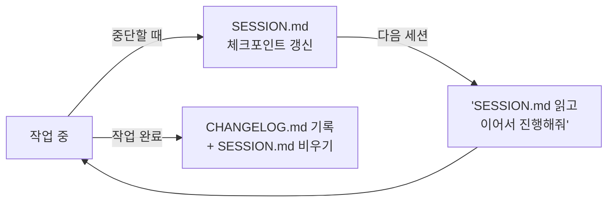

# 05. 세션 이어가기 (Session Continuity)

Claude Code 세션은 닫으면 대화 맥락이 사라집니다. 긴 작업을 며칠에 걸쳐 하거나
중간에 자리를 비울 때는 **어디까지 했고 다음에 뭘 할지**를 파일로 남겨야
다음 세션이 처음부터 다시 설명받지 않고 이어갈 수 있습니다.



## 기록 장치의 역할 구분 — 이것만 기억하세요

> **하다 만 일은 SESSION.md, 끝난 일은 CHANGELOG.md.**

| 장치 | 무엇을 기록 | 언제 |
|---|---|---|
| `SESSION.md` (프로젝트 루트) | **진행 중** 작업의 체크포인트 | 중단할 때마다 갱신, **완료되면 비움** |
| `CHANGELOG.md` | **완료된** 작업의 기록 | 작업 끝났을 때 맨 위에 추가 |
| PLAN/REVIEW/VERIFY 보고서 | 게이트 판정과 근거 | 각 단계 산출물로 자동 생성 |

SESSION.md에 완료 기록을 쌓지 마세요 — 그건 CHANGELOG의 몫이고,
SESSION.md가 길어지면 "지금 뭘 하고 있었는지"가 묻혀서 체크포인트 구실을 못 합니다.

## SESSION.md 템플릿

중단할 때 Claude에게 **"SESSION.md에 체크포인트 남겨줘"** 한 마디면 됩니다.
직접 쓸 때는 아래 4개 항목만:

```markdown
# 세션 체크포인트 (YYYY-MM-DD HH:MM)

## 지금 하던 일
- (예: PLAN_로그인.md Phase B 구현 중 — 모델 함수는 완성, API 연결부 미완)

## 다음에 할 일 (순서대로)
1. (예: routes.py 에 로그인 엔드포인트 연결)
2. (예: pytest 실행 → 통과하면 impl-verifier 검증 → CHANGELOG 기록)

## 지금까지의 판단/결정 (다시 설명 안 해도 되게)
- (예: 세션 저장은 A안(서버 사이드)으로 확정 — REVIEW에서 B안 보안 결함 지적됨)

## 재개할 때 첫 명령
- (예: "SESSION.md 읽고 이어서 진행해줘")
```

작성 요령:
- **"다음에 할 일"이 가장 중요** — 다음 세션의 Claude는 이 목록 1번부터 시작합니다.
- "판단/결정"에는 이미 확정된 선택을 적으세요. 없으면 다음 세션이 같은 논의를 반복합니다.
- 파일 경로·문서명은 정확히 (예: `PLAN_로그인.md Phase B` — "아까 그 계획" ❌).

## 세션 재개 방법

새 세션에서 이 한 줄이면 됩니다:

```
SESSION.md 읽고 이어서 진행해줘
```

상황별 대안:

| 상황 | 명령 |
|---|---|
| SESSION.md가 없거나 오래됨 | `CHANGELOG.md 맨 위 항목 읽고 상황 파악해줘` |
| 게이트 진행 중이었음 | `PLAN_<주제>.md 와 최신 REVIEW/VERIFY 보고서 읽고 다음 단계 진행해줘` |
| 뭘 하고 있었는지 기억 안 남 | `SESSION.md, CHANGELOG.md 맨 위, 최근 PLAN 문서 읽고 현재 상태 요약해줘` |

## 언제 새 세션을 여는 게 좋은가

- **주제가 바뀔 때** — 기능 A 작업 중 무관한 버그 B를 시작하면 맥락이 섞이고
  길어집니다(비용도 증가 — [cost.md](cost.md)). 체크포인트 남기고 새 세션 권장.
- **한 세션이 너무 길어졌을 때** — 응답이 느려지거나 이전 맥락을 헷갈리기 시작하면
  체크포인트 → 새 세션이 오히려 정확합니다.
- 5단계 게이트는 단계 사이가 자연스러운 전환점입니다 (산출물이 파일로 남으므로
  다음 세션이 보고서만 읽으면 이어갈 수 있음).

## .gitignore 참고

SESSION.md는 개인 작업 메모 성격이면 `.gitignore`에 추가하고, 팀이 함께 보는
체크포인트로 쓰려면 커밋하세요 (팀 규칙으로 정하면 됩니다).
